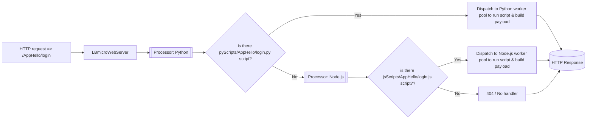

# LBWebPrism

LBWebPrism is part of **LBToolkit** and provides a lightweight, flexible way to integrate **Python** and **Node.js** scripting into a Pascal-powered HTTP/WebSocket server. Instead of forcing a single framework or architecture, LBWebPrism acts like a **prism**: it takes an incoming request and dispatches it to the correct scripting environment based on the available file.

## Why LBWebPrism

LBWebPrism was born out of a personal need: combining the computational power of **Python** (e.g., image processing with YOLO and similar libraries) with the vast ecosystem of **Node.js**, where ready-to-use modules exist for many common problems. The result is a bridge that allows you to use both worlds seamlessly.

LBWebPrism can run as a **stand-alone server** or be used as part of a larger application through its **C-style shared library interface**. This means it can be integrated in nearly any environment, even if the main project is not written in Pascal.

## How it works (in short)

LBWebPrism follows a **Chain of Responsibility**:

1. `LBmicroWebServer` receives the HTTP request.
2. The **Python Processor** checks if a matching script exists in the Python scripts folder.
3. If found, it dispatches to the Python worker pool and **the chain stops**.
4. Otherwise, the request **falls through** to the **Node.js Processor**, which checks for the script's existence in the Node.js scripts folder.
5. If neither is found, the server returns `404`.

This design allows you to structure your business logic in **Python**, **Node.js**, or a **hybrid** of both, without forcing a rewrite of your existing application.


## Folder Structure and routing

LBWebPrism uses a simple and flexible folder-based routing system. The two main script folders are defined in a configuration file.
Each folder can be freely organized by developers. A common pattern is to group related scripts into subfolders representing logical modules or applications.


### Example Structure

LBWebPrism/
├── pyScripts/
│   └── AppHello/
│       └── elaborateImage.py
├── jsScripts/
│   └── AppHello/
│       ├── login.js
│       └── search.js
├── config.ini
└── LBmicroWebServer.exe


### Routing Behavior

A request to `http://yoursite.com/AppHello/login` will be resolved as follows:

1. Check for `pyScripts/AppHello/login.py`  
2. If not found, check for `jsScripts/AppHello/login.js`  

A request to `http://yoursite.com/AppHello/elaborateImage` will be resolved as:

1. Check for `pyScripts/AppHello/elaborateImage.py`  
2. If not found, check for `jsScripts/AppHello/elaborateImage.js`  

This structure allows developers to split business logic across Python and Node.js, or keep it unified in one language. Each subfolder can represent a microservice, a feature, or a domain.


## Configuration Example

```ini
[LBmicroWebServer]
Port=10320

[PythonBridge]
ThreadPoolSize=2
WorkerTimeout=10000
ScriptsFolder=./pyScripts
SharedMemorySize=1048576

[NodeJSBridge]
ThreadPoolSize=2
WorkerTimeout=10000
ScriptsFolder=./jsScripts
SocketFilename=/tmp/PrismNodeJs.sock
```

These few lines are enough to enable a pool of Python and Node.js workers side by side.


## Request processing (Chain of Responsibility)



## Key Features

- **Folder-based routing**: Simple mapping of URL paths to script files
- **Hybrid scripting**: Seamlessly mix Python and Node.js business logic
- **Thread-safe pools**: Efficient request processing with configurable thread pools
- **C-style shared library interface**: Usable in virtually any host language
- **Future-proof**: Can be extended with load-balancing processors for multi-server deployments

---

LBWebPrism is not a framework that dictates rules. It’s a **building block** that you can use standalone or integrate it without rewriting your code, and decide if your back-end logic belongs to Python, Node.js, or both.
